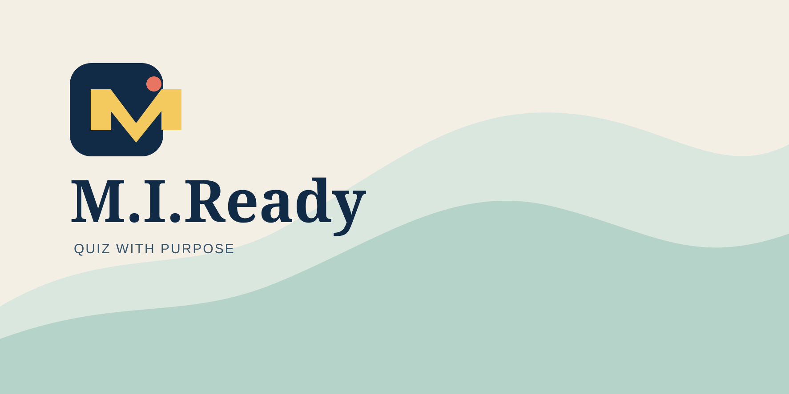

<h1 align="center">M.I.Ready</h1>

  A lightweight, offline-first quiz app built with Next.js.

---

## ✨ Features

- 📥 Import questions via JSON (paste or upload)
- 💾 Save quizzes locally in your browser
- ▶️ Run quiz sessions instantly
- 📊 Score tracking and feedback
- ⚡ No backend required — works fully client-side

---

## 🛠 Built With

- Next.js
- React
- TypeScript (if you're using it)
- Tailwind CSS (assuming you are, because everyone is)
